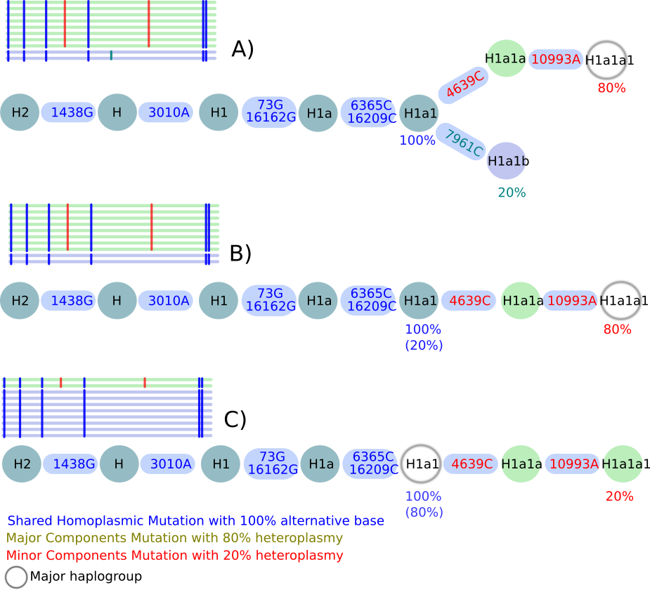
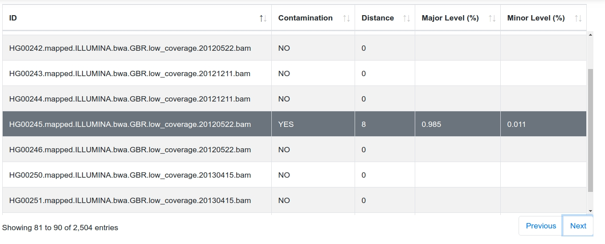
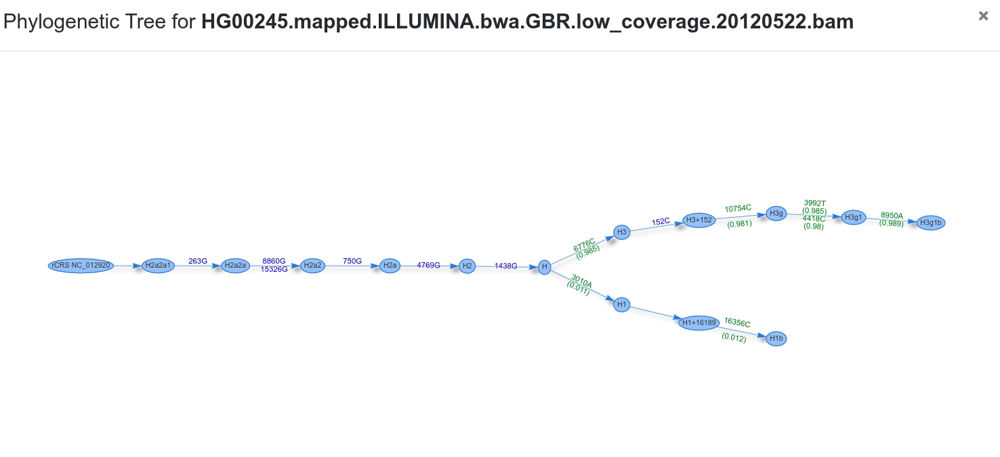
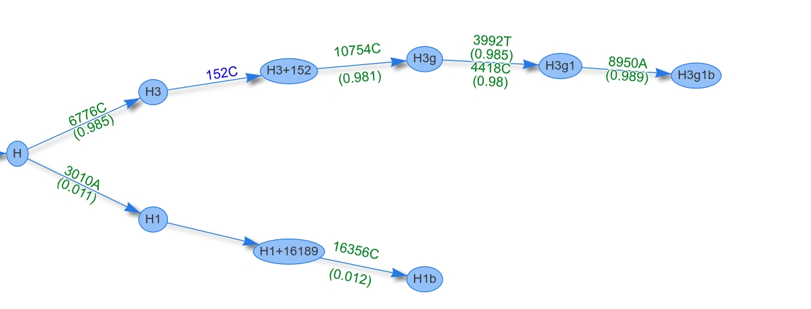

## Getting Started

To calculate the contamination levels for each sample, two options are available. Here, the 1000G Phase 3 file (n=2,504) is checked for contamination. 

        
### Run Haplocheck as a web service

- [Download](https://github.com/genepi/haplocheck/raw/master/test-data/contamination/1000G/all/1000g-nobaq.vcf.gz) the pre-computed 1000G VCF file.  
- Go to [mitoverse](https://mitoverse.i-med.ac.at) and login or sign-up for a new account.
- Select the haplocheck workflow and upload the variant file.
- After ~ 2 minutes all results are available for download. 

## Contamination Method

Haplocheck works by detecting two different components (or mitochondrial haplotypes) within one sample. Each heteroplasmic position is split into two components and added to a major and minor profile. Additionally, homoplasmic positions are added to both profiles. Each profile is then classified into a haplogroup. Since Haplogrep detects two components, we always output the contamination level of the minor and major component. 

When analysing the output, three different scenarios are possible (see Figure): 

### Scenario A

In this scenario haplocheck is able to identify a major and minor haplotype: The homoplasmic mutations (*marked in blue*) are present in both haplotypes and defining haplogroup **H1a1**. Three additional heteroplasmic positions are included in the sample. Haplocheck detects the **minor haplogroup H1a1b** including 7961C with 20% (i.e. included in 20 % of the reads) and the **major haplogroup H1a1a1** including 4639C + 10993A with 80 % (i.e. included in 80 % of the reads).

### Scenario B 

This scenario describes a mixture of two haplotypes within a single lineage but of different lineage depths. Again, the homoplasmic positions define the haplogroup H1a1. Two additional heteroplasmies 4639C + 10993A have been detected with 80 % which define the **major haplogroup H1a1a1**. No minor haplotype has been detected using the available heteroplasmic mutations. Therefore, the final minor haplotype is included in **H1a1**.   
 
### Scenario C

This scenario describes again a mixture of two haplotypes within a single lineage but of different lineage depths. Again, the homoplasmic positions define the haplogroup H1a1. Two additional heteroplasmies 4639C + 10993A have been detected with 20 % which define the **minor haplogroup H1a1a1**. No major haplotype can be detected using available heteroplasmic mutations. Therefore, the final major haplotype is included in **H1a1**.
 
 

 
 
## Interpret Results

Haplocheck reports the contamination status for each mitochondrial input sample and creates (a) a graphical report ([Example Report](sample/report.html)) and (b) a textual description ([Example Contamination File](sample/contamination.txt)).

### Graphical Report

The graphical report includes the most important information from the textual result file (see Textual Report File below). The table can be filtered, sorted and searched by specific samples. Additionally, for each sample a phylogenetic tree is generated using the graph information from Phylotree 17.

#### Phylogenetic Tree
The tree starts at the root node (rCRS) and shows homoplasmic (blue) / heteroplasmic (green) positions for each transition until the final haplogroup (as assigned by Haplogrep) has been reached. The two branches represent the final haplogroups of the major and minor profile. In our case the two profiles are **H1b** and **H3g1b**.

### Textual Report File

A text file including all required information is created by haplocheck. The following columns are included in the tab-delimited file (The header corresponds to the column name)

#### Sample

This column includes the sample identifier. (*before v1.0.7: SampleID*)

#### Contamination Status
Haplocheck works by splitting each input sample into two profiles, the so called **major** and **minor** component. Homoplasmies are always added to both profiles, heteroplasmies are split and added to the correct profile. Depending on several internal parameters (e.g. distance between haplogroups, number of heteroplasmies), haplocheck assigns a contamination status to each sample. This column can either be **YES** or **NO**. (*before v1.0.7: Contamination*)

#### Overall Homoplasmies
Total number of included homoplasmies in the sample. (*before v1.0.7: SampleHomoplasmies*)

#### Overall Heteroplasmies
Total number of included heteroplasmies in the sample. (*before v1.0.7: SampleHeteroplasmies*)

#### Sample Coverage
The columns defines the mean coverage for the sample.  (*before v1.0.7: SampleMeanCoverage*)

#### Major Haplogroup
The major haplogroup is calculated by using [Haplogrep](http://haplogrep.uibk.ac.at/). The input profile includes all homoplasmies and the **major** component of each heteroplasmy.  (*before v1.0.7: HgMajor*)

#### Major Haplogroup Quality

This columns includes the haplogroup quality (provided by Haplogrep). Click [here](http://haplogrep.uibk.ac.at/blog/explaining-the-formula/) for details how the metric (so called *Kulczynski* measure) is calculated.  (*before v1.0.7: HgQualityMajor*)

#### Minor Haplogroup

The minor haplogroup is calculated by using Haplogrep. The input profile includes all homoplasmies and the **minor** component of each heteroplasmy.  (*before v1.0.7: HgMinor*)

#### Minor Haplogroup Quality  

This columns includes the haplogroup quality score (provided by Haplogrep). Click [here](http://haplogrep.uibk.ac.at/blog/explaining-the-formula/) for details how the metric (so called *Kulczynski* measure) is calculated. (*before v1.0.7: HgQualityMinor*)

#### Major Homoplasmies Count

Number of homoplasmies included in the **major** haplogroup. Please keep in mind that Haplogrep assigns the best haplogroup hit by traversing through the graph. Therefore not always all homoplasmies or heteroplasmies (as defined in the input profile) are required for the best hit.  (*before v1.0.7: HomoplasmiesMajor*)

#### Minor Homoplasmies Count

Number of homoplasmies included in the **minor** haplgroup.  (*before v1.0.7: HomoplasmiesMinor*)

#### Major Heteroplasmies Count

Number of heteroplasmies included in the **major** haplgroup.  (*before v1.0.7: HeteroplasmiesMajor*)

#### Minor Heteroplasmies Count

Number of heteroplasmies included in the **minor** haplgroup.  (*before v1.0.7: HeteroplasmiesMinor*)

#### Major Heteroplasmy Level

The major heteroplasmy level is calculated by averaging the level of each heteroplasmy (major components only). Additionally, only heteroplasmies from the common ancestor (so in our sample node **H**) are added to the level. The figure below shows the phylogenetic graph of sample HG00245. **H** is the common ancestor for both profiles, therefore only the heteroplasmies `6776C (0.985)`, `10754C (0.981)`, `3992T (0.985)`, `4418C (0.98)` and `8950A (0.989)` are used for the level calculation. By averaging all levels, a final major level of `0.984` is assigned. (*before v1.0.7: MeanHetLevelMajor*)

#### Minor Heteroplasmy Level

The minor heteroplasmy level is calculated by averaging the level of the minor component of each heteroplasmy. The sample HG00245 includes two minor components (`3010A (0.011)`, `16356C (0.012)`) to calculate the final heteroplasmy level of `0.011`.  (*before v1.0.7: MeanHetLevelMinor*)

#### Distance

This column defines the distance between the haplogroups of the major and minor profile using the graph structure of Phylotree 17. In the sample above, the distance would be `8` (Nodes between *H1b* and *H3g1b*). (*before v1.0.7: HG_Distance*)

#### Clusters

All heteroplasmies are clustered using the *Jenks natural breaks classification* method. This information is provided to the user to see the identified clusters by haplocheck.
 
 
 
 ## FAQ

**What is the difference b/w overall homo/heteroplasmies and number major/minor homo/heteroplasmies?**  

Overall homoplasmies/heteroplasmies **count** the number of variants found in a sample. E.g. sample **17.bam** includes 10 homoplasmic variants and 8 heteroplasmic variants. Haplocheck splits the variants into two profiles, the so called major and minor profile. The major profile includes all homoplasmies (**10**) and the major allele of each heteroplasmy. The minor profile includes again all hoomoplasmies (**10**) and the minor allele of each heteroplasmy. For both profiles, the haplogroup is calculated using Haplogrep. Ideally, all variants are used and a quality score of 1 is reached by Haplogrep. Since neither the input profile nor the phylogeny is perfect, some of the input homoplasmies or heteroplasmies are missed by Haplogrep. This results in a Haplogrep quality score between 0.5 and 1. The columns *major/minor homoplasmies/heteroplasmies* count the number of variants that have been finally used for the best haplogroup hit and can therefore differ from the overall homoplasmies/heteroplasmies.    

**What does the heteroplasmy level represent?**

The heteroplasmy level denotes the averaged allele frequency (VAF) and is calculated for both the major heteroplasmic allele (column *Major Heteroplasmy Level*) and minor heteroplasmic allele (column *Minor Heteroplasmy Level*).

**How is the heteroplasmy level calculated?**

The major and minor heteroplasmy level is calculated by averaging the allele frequency of both alleles.  Only heteroplasmies from the most previous common ancestor are used for this calculation. For example, if **H1a1** is the common ancestor of the profiles H1a1a1 (**major**) and H1a1b (**minor**), only heteroplasmies starting from H1a1 are included for calculation. Furthermore, we only add heteroplasmies with a mutation rate > 5 (as defined by HaploGrep) and excluding back mutations as well as deletions on heteroplasmies.

**How is the label contamination (YES versus NO) decided exactly?**

Haplocheck uses the mitochondrial phylogeny and the concept of haplogroups to identify contamination. It is heavily based on [Haplogrep](https://github.com/seppinho/haplogrep-cmd) and [Mutserve](https://github.com/seppinho/mutserve). Mutserve allows to detect low-level variants (or in case of mtDNA so called **heteroplasmies**) down to the variant level of 1 %. Haplocheck splits the input into two profiles and calculates the haplogroup for each profile using Haplogrep. Identical haplogroups are marked with the contamination status of **NO**. If the haplogroup between two profiles differ, high confident heteroplasmies are determined by haplocheck and the distance between the two profiles is calculated. Depending on the (a) number of heteroplasmies, (b) haplogroup quality score and (c) distance between two profiles a YES or NO label is assigned.
To assign a correct YES/NO labels contamination can be occur on (a) two separate branches (b) same major branch or (c) same minor branch. Please also have a look at the [contamination method](https://mitoverse.readthedocs.io/en/latest/method/) itself to learn about different kinds of contamination.

**How did you evaluate Haplocheck?**

To find the best setup, we created and analyzed in-silico data by mixing random profiles from the currently best available mtDNA phylogeny derived from Phylotree. In total, 6 different datasets (3 datasets with 500,000 mixtures each, 3 datasets with 100,000 mixtures each) have been created and the F1-Score (defined as `2 x precision x sensitivity / (precision + sensitivity)`) has been calculated to analyze the overall accuracy of haplocheck. To evaluate the overall performance of haplocheck on a real data set, we re-analyzed 1KGP Phase 3 (n = 2,504) and compared our results with the publicly available data regarding contamination status derived from verifyBamID.
 
 
## How to cite

Weissensteiner H, Forer L, Fendt L, Kheirkhah A, Salas A, Kronenberg F, Schoenherr S. 2021. Contamination detection in sequencing studies using the mitochondrial phylogeny. Genome Research. http://dx.doi.org/10.1101/gr.256545.119.
 