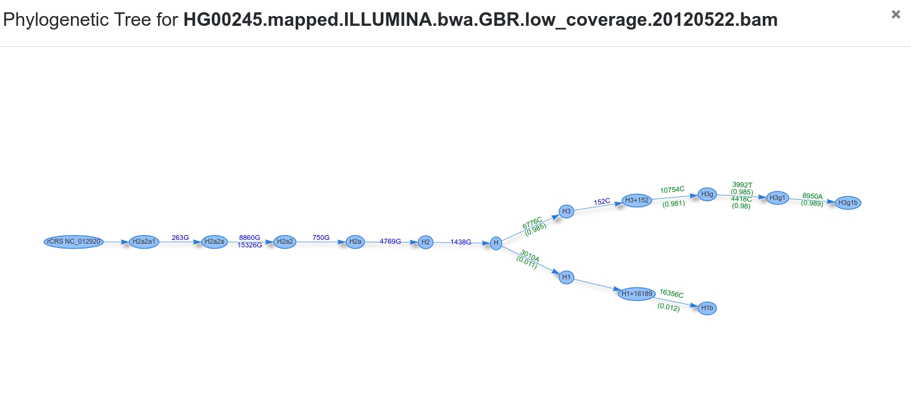

# Mitoverse

[Mitoverse](https://mitoverse.i-med.ac.at) is a platform for mitochondrial (mtDNA) apps & data. The overall goal is to provide a universe of apps that help researchers analysing mtDNA data. Mitoverse is based on [Cloudgene](http://www.cloudgene.io/), a plugable cloud platform for genomic research.

## Haplocheck

Haplocheck is a contamination detection tool using the mtDNA phylogeny.. You can upload alignment files (BAM,CRAM) or variant files (vcf, vcf.gz) and receive a graphical and textual report which can be shared with collaborators.

Currently the workflow includes the following steps:

* Variant and Heteroplasmy Detection 
* Haplogroup Detection with Haplogrep2
* Contamination Detection
* Graphical Report Creation

Haplocheck is already available in mitoverse. Please click [here](https://mitoverse.i-med.ac.at/index.html#!run/haplocheck) to run your first contamination check.

### Installation

        curl -s install.cloudgene.io | bash -s 2.0.0-rc14
        ./cloudgene install https://github.com/genepi/haplocheck/releases/download/v1.0.5/haplocheck.zip
        ./cloudgene run haplocheck@1.0.5 --files <input-files> --output <folder>  
        

### Analyse Result Files 

Haplocheck reports the contamination level for each sample. The overall table includes the (a) Contamination Status, (b) Haplogroup Distance between both components, (c) Major Level (%) and the (d) Minor Level (%). Haplogroup reports two levels, since a contamination is possible on both haplogroup components (major and minor). 

To check for contamination in detail, we provide for each mixture a graphical representation of the phylogenetic tree. The tree starts at the root node (rCRS) and shows homoplasmic (blue) / heteroplasmic (green) positions for each transition.

