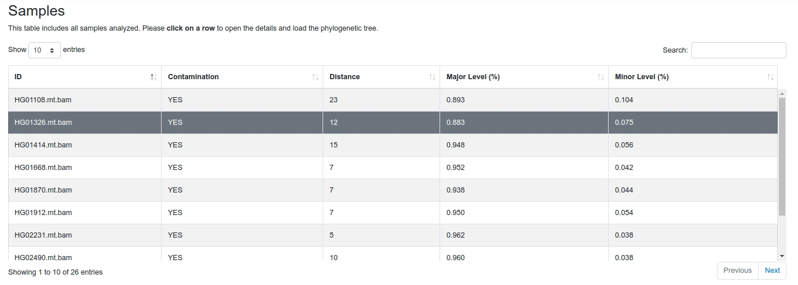
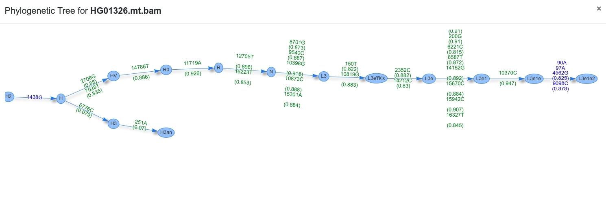

## Interpret Results 

Haplocheck reports the contamination status for each mitochondrial input sample and creates (a) a graphical report and (b) a textual description.

### Graphical Report

The graphical report includes an HTML table including the most important information from the textual result file (see below). The table can be filtered, sorted and searched by specific samples. Additionally, for each sample a phylogenetic tree is generated using the graph information from Phylotree 17.
 

#### Phylogenetic Tree
The tree starts at the root node (rCRS) and shows homoplasmic (blue) / heteroplasmic (green) positions for each transition until the final haplogroup (as assigned by Haplogrep) has been reached. The two branches represent the final haplogroups of the major and minor profile. 

### Textual Report File

A text file including all rquired information results is created. The following information is included:

#### Sample

This column includes the sample identifier. 

#### Contamination Status

Haplocheck works by splitting each input sample into two profiles, the so called "major" and "minor" component. Homoplasmies are always added to both profiles, heteroplasmies are split and added to the correct profile. Depending on several internal paramters (e.g. distance between haplogroups, amount of heteroplasmies), haplocheck assigns a contamination status to each sample. This column can either be "YES" or "NO". 

#### Overall Homoplasmies
Amount of included homoplasmies in the sample.

#### Overall Heteroplasmies
Amount of included heteroplasmies in the sample.

#### Sample Coverage

The columns defines the mean coverage for the sample. 

#### Major Haplogroup

The major haplogroup is calculated by using Haplogrep using a input profile. The input profile includes all homoplasmies and the **major** component of each heteroplasmy. 

#### Major Haplogroup Quality

This columns includes the haplogroup quality (provided by Haplogrep). See [here](http://haplogrep.uibk.ac.at/blog/explaining-the-formula/) for details how this is calculated.

#### Minor Haplogroup

The minor haplogroup is calculated by using Haplogrep using a input profile. The input profile includes all homoplasmies and the **minor** component of each heteroplasmy. 

#### Minor Haplogroup Quality

This columns includes the haplogroup quality score (provided by Haplogrep). See [here](http://haplogrep.uibk.ac.at/blog/explaining-the-formula/) for details how this is calculated.

#### Amount Major Homoplasmies

Amount of homoplasmies used for the **major** haplgroup. Please keep in mind that Haplogrep assigns the best haplogroup hit by traversing through the graph. Therefore not all homoplasmies are required for the best hit. 

#### Amount Minor Homoplasmies

Amount of homoplasmies used for the **minor** haplgroup. 

#### Amount Major Heteroplasmies

Amount of heteroplasmies used for the **major** haplgroup. 

#### Amount Minor Heteroplasmies

Amount of heteroplasmies used for the **minor** haplgroup. 

#### Major Heteroplasmy Level

The major heteroplasmy level is calculated by averaging the level of each heteroplasmy (major component only). For this level, only heteroplasmies from the common ancestor of the major profile are used. Figure below shows the phylogenetic graph of sample HG00245. H is the common ancestor for both components, therefore only heteroplasmies `6776C (0.985)`, `10754C (0.981), `3992T (0.985)`, `4418C (0.98)` and `8950A (0.989)` are used for the level calculation. By averaging all levels, a final major level of `0.984` is calculated. 

#### Minor Heteroplasmy Level

The minor heteroplasmy level is calculated by averaging the level of the minor component of each heteroplasmy. For sample HG00245 only the minor compoment of `3010A (0.011)` and `16356C (0.012)` is used resulting in a final heteroplasmy level of `0.011`. 

#### Distance

This column defines the distance between the haplogroups of the major and minor profile using the graph structure of Phylotree 17. 

#### Clusters 

All heteroplasmies are clustered using the Jenks natural breaks classification method. This information is provided to the user, to see if different clusters can be identified by haplocheck. 

