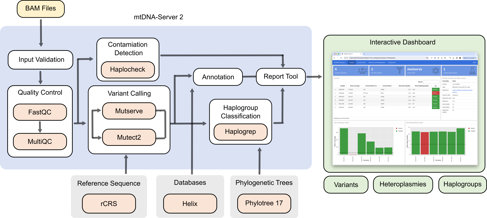
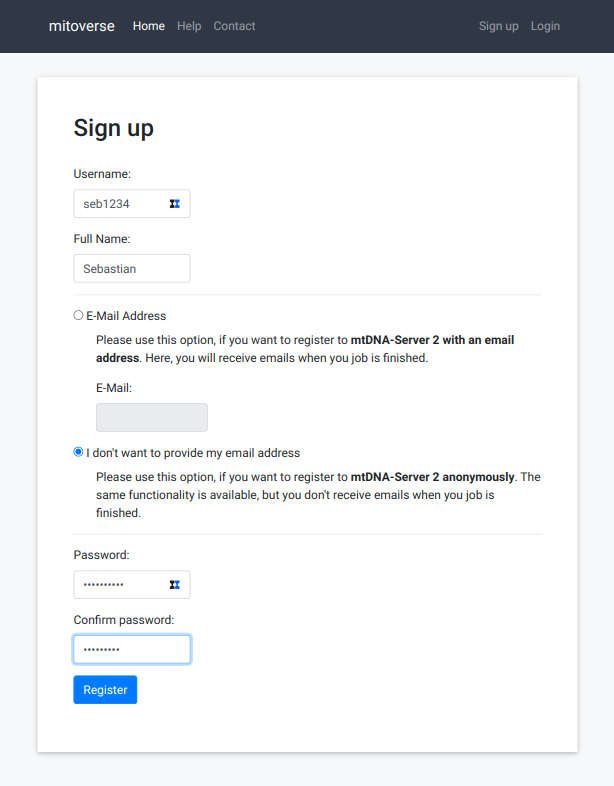
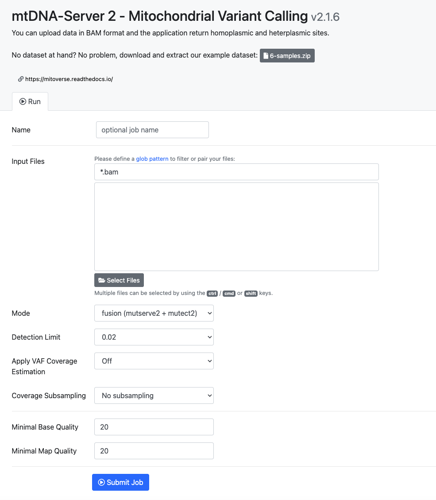
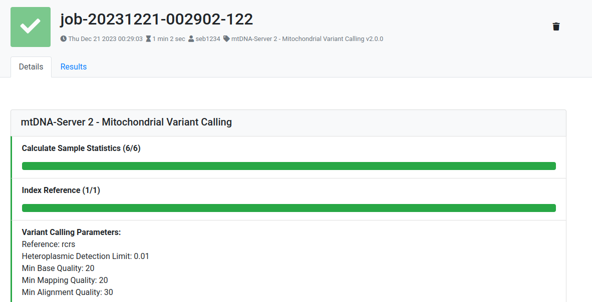
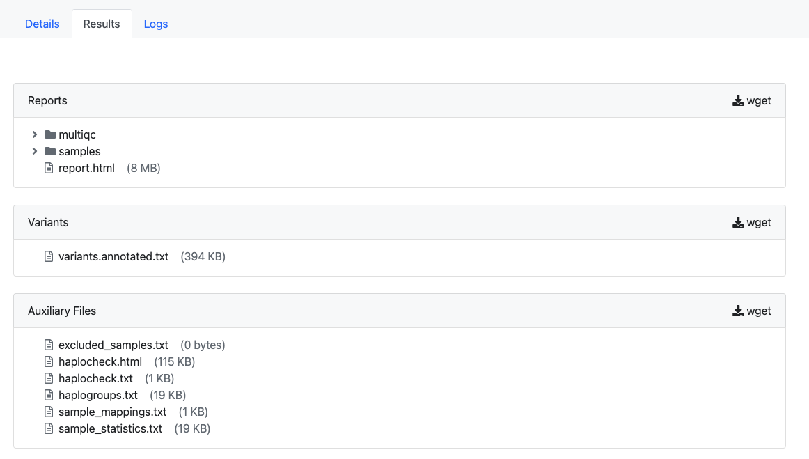
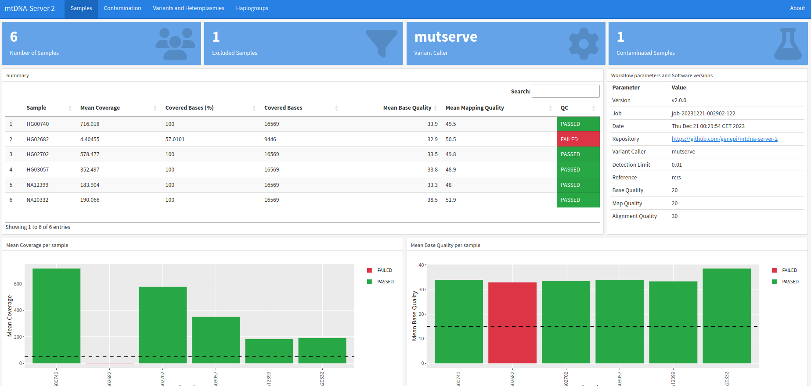
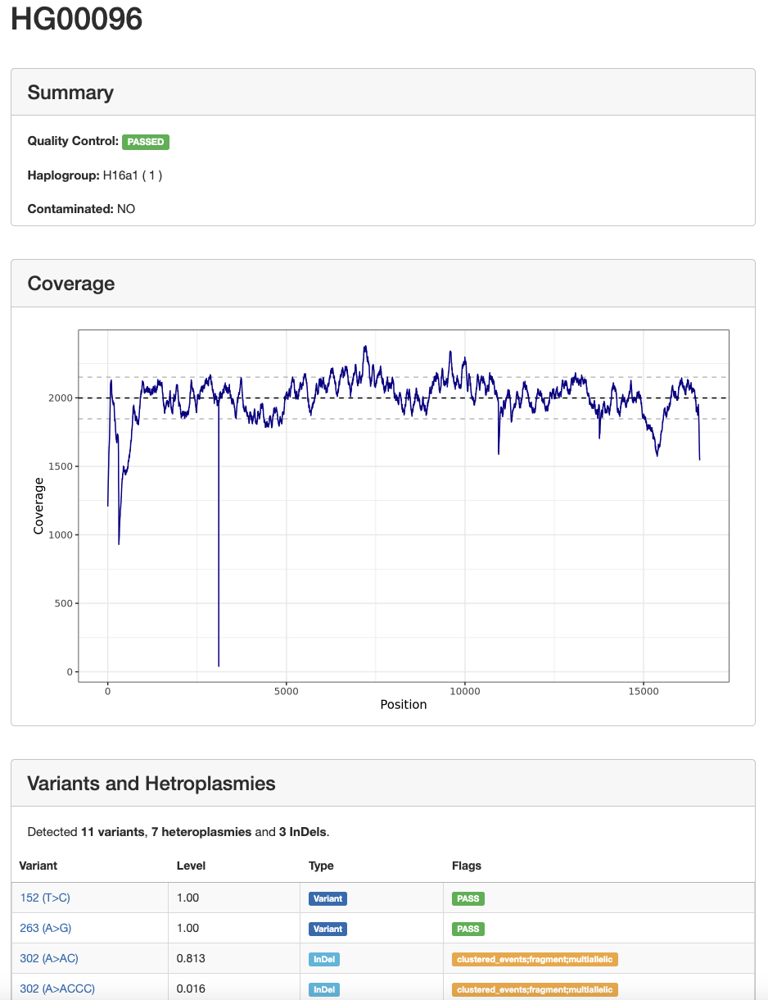

# mtDNA-Server 2

mtDNA-Server 2 offers a free service for analyzing human mitochondrial DNA data, with a primary focus on reliable heteroplasmy detection (≥ 2%) and contamination assessment. 

**mtDNA-Server 2 is implemented as a Nextflow DSL 2 pipeline, available both as a web service and for download. Both options are described below.** 

## Overview
First, users specify BAM files (via service upload or a Nextflow DSL 2 config file), and an *Input Validation* step is executed. For all samples that pass this step, the *Quality Control* step follows, which includes generating a FastQC report that is summarized with MultiQC. Next, *Variant Calling* is performed using one of the available variant callers (**mutserve** or **Mutect2**). In **fusion mode**, Indels from Mutect2 are combined with SNP calling from mutserve. The *Annotation* step provides detailed annotations for the detected variants, while the *Contamination Detection* step is performed using **haplocheck**. The *Haplogroup Classification* process is then carried out using the previously published **Haplogrep3** tool. Finally, all generated files are summarized within the *Report Tool* step in an interactive HTML report.





## Web Service

### Registration
The sign-up process on mitoverse is straight-forward. After accessing the landing page, click on "Sign up". Mitoverse allows to register **with or without an email**. In case no email is specified, mitoverse does not send a job status email.



### Job Submission
After sign-up is completed, user are able to submit new jobs. Users can submit BAM files and specify numerous parameters:

#### Input Files
The "Input Files" field enables you to select one or multiple mtDNA aligned reads in BAM Format. These files contain the genetic information necessary for the analysis performed by the mtDNA-Server 2.

#### Mode
In the "Mode" field, you can select the mode for analysis. Options include fusion, mutect2, and mutserve. Choosing the appropriate mode ensures that the analysis is tailored to your specific requirements.

#### Detection Limit
The "Detection Limit" field allows you to select the detection limit for the analysis. This parameter determines the sensitivity of the analysis to detect mutations or variations in the input data.

#### Apply Coverage Estimate
With the "Apply Coverage Estimate" field, you can choose whether to apply coverage estimation. This option helps in assessing the depth and uniformity of coverage across the input data, aiding in the accuracy of the analysis results.

#### Coverage Subsampling
Specify the desired mean coverage by entering the number of coverage you want to use. mtDNA-Server 2 automatically subsamples the uploaded reads to achieve this mean coverage. Enter "0" to deactivate coverage subsampling.

#### Minimal Base Quality
In the "Minimal Base Quality" field, specify the minimal base quality required for analysis. This parameter ensures that only high-quality bases are considered during the analysis process, improving the reliability of the results.

#### Minimal Map Quality
The "Minimal Map Quality" field allows you to specify the minimal map quality required for analysis. This parameter helps filter out reads with poor mapping quality, ensuring that only accurately mapped reads contribute to the analysis.
        |



### Job Monitoring
Mitoverse returns constant feedback to the users about the current job status (waiting, running, finished) and also return details about each job step. 



### Job Results

All results are available in the Results tab. This currently includes a QC-report, the annotated variants, haplogroup and sample information as well as an interactive report (report.html).




## Nextflow DSL2 Pipeline

To run mtDNA-Server 2 via Nextflow on the command line, follow the steps below.

1) First, install [Nextflow](https://www.nextflow.io/docs/latest/install.html#installation) (>=22.10.4) and [Docker](https://www.docker.com/).

2) Next, create a new folder on your local disk and download a test BAM file into it.
```
mkdir mtdna-server-2
cd mtdna-server-2
wget https://github.com/genepi/mtdna-server-2/raw/refs/heads/main/tests/data/bam/mitohpc/sample_S.bam
```

3) Next, create a new text file, copy the content below, and save it as `mtdna-server-2.config`.
```
params {
    project         = "test-job"
    files           = "*.bam"
    output          = "results/"
    detection_limit = 0.03    
    mode            = "fusion"
}
```

4) You are now ready to execute the latest pipeline. The command below will download the source code from GitHub and the latest Docker image, then run the pipeline on the downloaded BAM file. All available BAM files will be processed in parallel.

```
nextflow run genepi/mtdna-server-2 -r v2.1.16 -c mtdna-server-2.config -profile docker
```

!!! note
     Please note that we also provide other [profiles](https://github.com/genepi/mtdna-server-2/blob/main/nextflow.config), such as Slurm or Singularity.

After a few minutes, all files will be available for download in the specified `results` folder. The main file is the `report.html`, which contains a graphical report of the analysis. The primary variant file is `variants.annotated.txt`. See [below](#output) for further details.

!!! note
    Please note that the first execution takes longer, as the image needs to be downloaded.

### Parameters
The following parameters can be set in the configuration file above: 

| Parameter            | Default Value        | Comment        |
|----------------------|--------------|----------------|
| project              | null         | Project name (required)   |
| files                | null         | Input BAM files (required) |
| mode                 | fusion       | Mode of operation (mutserve,mutect2,fusion) |
| detection_limit      | 0.02         | Detection limit for heteroplasmic sites |
| coverage_estimation  | on           | Coverage estimation enabled |
| subsampling          | off          | Subsampling on/off |
| subsampling_coverage | 2000         | Subsampling coverage |
| mapQ                 | 20           | Mapping quality threshold |
| baseQ                | 20           | Base quality threshold |
| alignQ               | 30           | Alignment quality threshold |
| min_mean_coverage               | 50           | Min Mean coverage |
| output               | null         | Specific Output folder   |


## Output Files

### Report
After the job has been finished, users can download the interactive report to explore the data in detail which can also be easily shared with collaborators without a login.



By clicking on a sample name, a new tab opens with more details of the sample and all detected variants and heteroplasmies:



### Variants

The file `variants.annotated.txt` contains detailed information about the detected variants, including annotations. It is a tab-delimited file with the following columns.

| Column                 | Description                                                                                     |
|------------------------|-------------------------------------------------------------------------------------------------|
| Mutation               | Defines variant with POS and ALT allele                                                        |
| POS                    | Position of the variant according to the rCRS, see [rCRS_annotated](https://phylotree.org/resources/rCRS_annotated.htm) |
| REF                    | Reference allele of the rCRS, see also [rCRS_annotated](https://phylotree.org/resources/rCRS_annotated.htm) |
| ALT                    | Alternative allele observed on the current position                                              |
| Substitution           | Type of Substitution: Transition (A>G, G>A, T>C, C>T) or transversion (other)                   |
| Maplocus               | 40 different loci, including 2 MT-DLOOP(1,2), 2 MT-RNR1(2), 13 genes MT-ATP6 -> MT-ND6, 22 tRNA and noncoding (empty) |
| Category               | 5 different categories: tRNA, rRNA, Coding, Control Region and “-” (noncoding)                 |
| Phylotree17_haplogroups| How many haplogroups in phylotree 17 have a variant                                             |
| Phylotree17_clades     | How many different occurrences (fluctuation rate) in different clades can be observed            |
| HaploGrep2_weight      | Weight based on the log-transformed value on the Phylotree17_clades. Value between 1 (highest value) and 10 (only occurring in 1 clade) |
| RSRS_SNP               | Is this SNP a RSRS defining SNP, see [RSRS_vs_rCRS](https://phylotree.org/resources/RSRS_vs_rCRS.htm) 1=yes, 0=no |
| KGP3_SNP               | Was this SNP observed in the 1000 Genomes Project Phase 3 (low-coverage) data? 1=yes, 0=no     |
| AAC                    | Amino Acid Change, denoted with the short Amino Acid Symbol, position on protein and the new amino acid change, e.g. M1L |
| CodonPosition          | Position of the codon defining the mRNA sequence, values: 1,2,3 or NA                           |
| AminoAcid              | The amino acid encoded by the reference based codon, e.g. M for Methionine                      |
| NewAminoAcid           | The amino acid encoded by the alternative codon, e.g. L for Leucine                             |
| AminoAcid_pos_protein  | Amino acids position on the produced protein                                                   |
| MutPred_Score          | Pathogenicity Score based on MutPred – see [MutPred](https://doi.org/10.1093/bioinformatics/btp528) – values between 0 (benign) and 1 with values > 0.5 potentially deleterious |
| mtDNA_Selection_Score  | Pathogenicity Score as presented in Pereira et al, [Pereira et al](https://doi.org/10.1016/j.ajhg.2011.03.006), log-transformed MutPred score – values between 0 and ~ 3 - values > 0.5 potentially deleterious |
| CI_MitoTool	         | Conservation Index (CI) as used in MitoTool, see 10.1016/j.mito.2010.09.013 and Ruiz-Pesini et al https://www.science.org/doi/full/10.1126/science.1088434  |
| OXPHOS_complex		 | Indicates whether a variant is on a gene encoding one of the  OXPHOS complexes I, III, IV or V  |
| NuMTs_dayama	         | SNP observed in the 1000 Genomes Project Phase 1 data occuring as part of a NUMT  (Dayama et al 10.1093/nar/gku1038) ? Numbers indicating how many fragments with SNP were found  |
| Helix_count_hom	     | Homoplasmic variant count in HelixMTdb https://www.helix.com/mitochondrial-variant-database  |
| Helix_count_het	     | Heteroplasmic variant count in HelixMTdb (see previous entry)  |
| Helix_vaf_hom	         | Variants Allele Frequency of homoplasmic variants in HelixMTdb = count / (n=~195,000)  |
| Helix_vaf_het	         | Variants Allele Frequency of heteroplasmic variants in HelixMTdb = count / (n=~195,000)  |
| Helix_haplogroups	     | Haplogroups (major clades) found with the variant in HelixMTdb e.g. H:7 indicates that haplogroup H was found to harbour the variant in 7 samples  |
| rCRS_Surr_seq	         | Surrounding nucleotides based on the POS of the current variant on the reference sequence rCRS e.g. (CCCTC[T/A]AAATC)  |
| LowComplexityRegion	 | Checks if rCRS_Surr_seq includes homopolymeric stretches of length 4 or longer (0 = no, 1=yes)  |
| DuplSeq_rCRS	         | Is this motif (rCRS_Surr_seq) length 11bps found on a different position on the rCRS (0=no, 1=yes)  |
| DuplSeq_rCRS_pos	     | If motif is found as duplicate (see previous field), coordinates of the position on the rCRS are provided here  |


### Auxiliary Files
The "Auxiliary Files" section includes additional files generated during the analysis.

- **excluded_samples.txt**: This file lists any samples that were excluded from the analysis, along with the reason for their exclusion.
- **haplocheck.html**: The HTML report from Haplocheck provides information about contamination.
- **haplocheck.txt**: The text file containing contamination information and quality assessment results from Haplocheck.
- **haplogroups.txt**: This file contains the assigned mitochondrial haplogroups for each sample analyzed.
- **sample_mappings.txt**: The sample mappings file provides information about the mapping between sample IDs and their corresponding filenames.
- **sample_statistics.txt**: This file contains statistical summaries and metrics for each sample analyzed in the study.